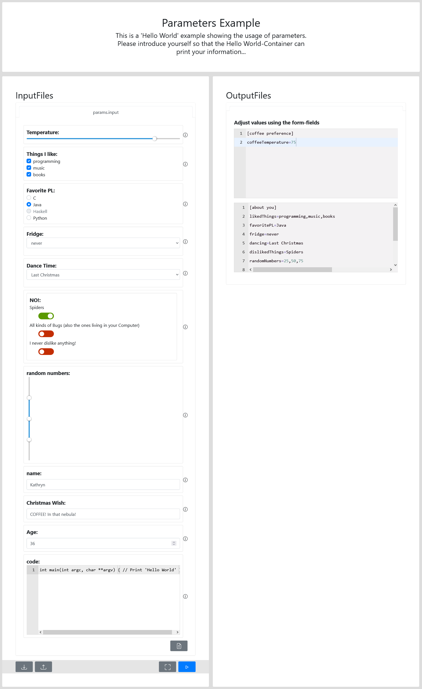

# Tutorial

## Situation
You have done some research and want to make the code you created available to other scientists, so they can take a better look at your results. 
For this, ViPLab was integrated into your institutions management system for research data (see Chapter on [Integration](../admin/integration.md))

---

## Steps
1. Create a Docker Container of your Research Software, that can be used by ViPLab
2. Write a Computation Template
3. See the Result in the ViPLab Frontend

---

### Easy Example
For this Tutorial we have created an easy example code, that just outputs information that was passed to the script using an INI-file.  

The bash scripts looks like this: 
``` sh title="run.sh"
#!/bin/bash
source <(grep = /data/shared/params.ini)
echo "Your name is $name"
echo "Your current age: $age"
echo "Your Christmas Wish is: $christmasWish"
echo "How hot do you like to drink your coffee? $coffeeTemperature"
echo "You like: $likedThings"
echo "Your favorite Programming Language is $favoritePL"
echo "You look in the fridge: $fridge"
echo "You would dance in the kitchen to: $dancing"
echo "You dislike: $dislikedThings"
echo "Your three random numers are: $randomNumbers"
echo "The Code you entered:"
echo `echo $codeSnippet | base64 -i --decode`
```

An example for the input-file called params.ini could look like this: 
``` ini title="params.ini"
[coffee preference]
coffeeTemperature=75
 
[about you]
likedThings=programming,music,books
favoritePL=Java
fridge=never
dancing="Last Christmas"
dislikedThings=Spiders
randomNumbers=25,50,75
name=Kathryn
christmasWish="COFFEE! In that nebula!"
age=36
codeSnippet="aW50IG1haW4oaW50IGFyZ2MsIGNoYXIgKiphcmd2KSB7IC8vIFByaW50ICdIZWxsbyBXb3JsZCcgfQ=="
```

!!! tip inline end
    Depending on which OS you are using you might have to execute `chmod +x run.sh` first

Calling...
``` sh
./run.sh 
```

... will result in the following output on the console: 

``` console
Your name is Kathryn
Your current age: 36
Your Christmas Wish is: COFFEE! In that nebula!
How hot do you like to drink your coffee? 75
You like: programming,music,books
Your favorite Programming Language is Java
You look in the fridge: never
You would dance in the kitchen to: Last Christmas
You dislike: Spiders
Your three random numers are: 25,50,75
The Code you entered:
int main(int argc, char **argv) { // Print 'Hello World' }
```

### 1. Create a Docker Container of your Research Software, that can be used by ViPLab

If you are not familliar with Docker, follow this link to the official website to find the right Download for your system and take a look at the docs: [Docker Website](https://www.docker.com/).
There is also a [first introduction to Docker](https://docs.docker.com/get-started/) available, with a few explainations and an image to try out. 
To create and runs your first Docker sample application, you can follow this [Tutorial](https://docs.docker.com/get-started/02_our_app/). 

After you set up Docker, you can start writing a Dockerfile for your research software. 
The file is placed in the same folder as your code. 

For the example code above, the Dockerfile would look like this: 

``` docker title="Dockerfile"
FROM ubuntu:latest
COPY run.sh /data/bin/run.sh
COPY params.ini /data/shared/params.ini
RUN chmod +x /data/bin/run.sh
ENTRYPOINT ["/data/bin/run.sh"]
```
!!! info "Explaination of the Dockerfile"
    First the latest Ubuntu-Docker-Image is selected as a starting point. After this, our files are copied to specific folders inside the container. Then `run.sh` is made executable using `chmod` before being run using the last command. 

After creating the file, open a terminal and go to the directory where your files are located, if you haven't done so, yet. 
To build the container image, run the following command:

``` docker
docker build -t hello-world-image .
```

After the build is finished, you can now start the container using...

```
docker run hello-world-image
```

... after which you will see the output shown in section [Easy Example](#easy-example). 

### 2. Write a Computation Template

*TODO: GUI CT Creator*

For more detail on the structure of the Computation Template, take a look at the [Developer Guide](../developer/computation_template.md).

### 3. See the Result in the ViPLab Frontend

Using the above created Computation Template, the Frontend will look like this: 

<figure markdown>
  
  <figcaption>ViPLab Frontend showing the Example</figcaption>
</figure>

After clicking the Play-Button, the Container will be executed by the Frontend and the Result will be returned, as seen in the Image below.

*TODO: Image of Result displayed in Frontend*
